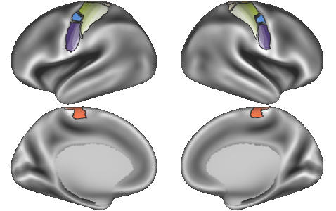

# mmp-somatotopy

  

This repository contains parcellation files for the somatotopic subareas of primary motor (M1) and somatosensory cortices (S1) defined in [Van Essen & Glasser (2018)](https://www.sciencedirect.com/science/article/pii/S0896627318305427). These subareas further subdivide the regional boundaries of M1 and S1 established in the Human Connectome Project Multi-Modal Parcellation version 1.0 (HCP-MMP1.0; [Glasser et al. (2016)](https://www.nature.com/articles/nature18933)) 

## Overview

- `parcellations/`
	- `SomatotopicAreas*`: Somatotopic areas defined by Van Essen & Glasser (2018)
	- `SomatotopicParc*`:  Sensorimotor regions of HCP-MMP1.0 subparcellated by somatotopic areas
- `labels/`: Label reference files for images `parcellations/`
- `scripts/`: Contains `make_parcels.py`, which generates all files in `parcellations/`
- `resources/`: Surface, border, and dlabel files required to generate the images in `parcellations/`. Border and surfaces files were obtained from the Van Essen and Glasser (2018) [BALSA repository](https://balsa.wustl.edu/study/show/xlZB)

## References

Glasser MF, Coalson TS, Robinson EC, Hacker CD, Harwell J, Yacoub E, Ugurbil K, Andersson J, Beckmann CF, Jenkinson M, Smith SM, Van Essen DC. 2016. A multi-modal parcellation of human cerebral cortex. Nature. 536:171–178.

Van Essen DC, Glasser MF. 2018. Parcellating Cerebral Cortex: How Invasive Animal Studies Inform Noninvasive Mapmaking in Humans. Neuron. 99:640–663.